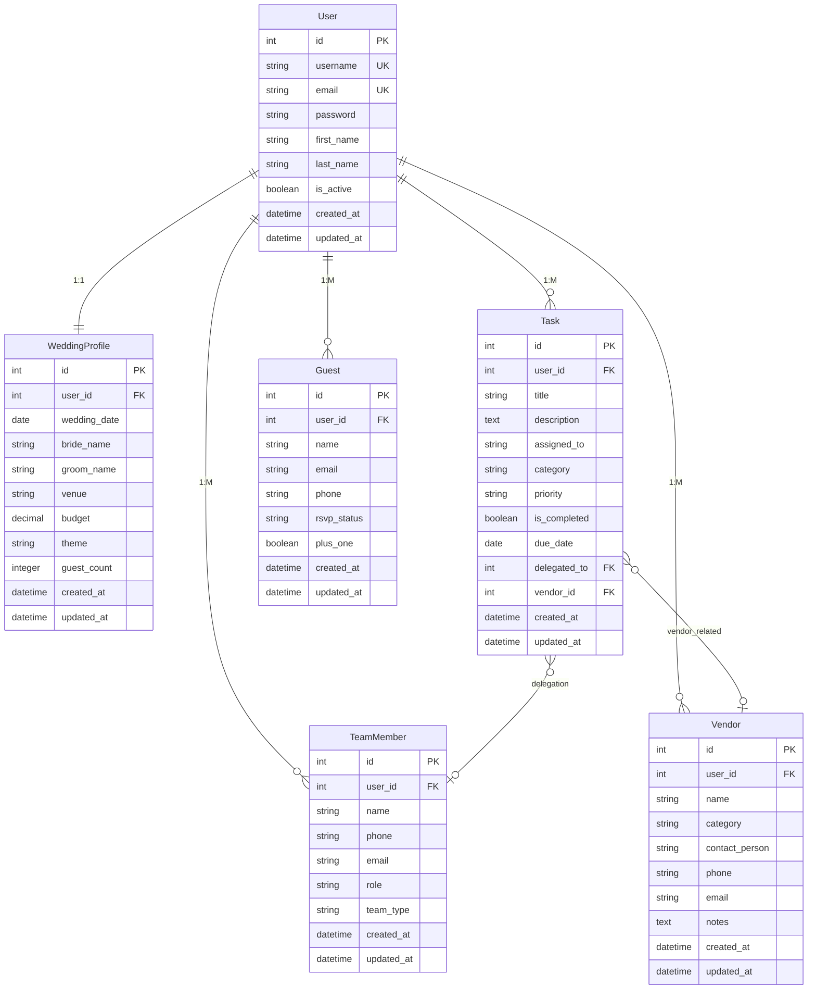

# Wedding Planning Platform: Entity Relationship Diagrams

## 🎯 **CAPSTONE PROJECT ERD** (Current MVP - Graduation Focus)



**CAPSTONE FOCUS POINTS:**
- ✅ **6 Core Models** - Sufficient for graduation requirements
- ✅ **Basic Relationships** - User owns everything, simple foreign keys
- ✅ **Essential Fields Only** - No complex enums or advanced features
- ✅ **CRUD Operations** - Create, Read, Update, Delete for all entities
- ✅ **Authentication** - User model with basic profile info
- ✅ **Business Logic** - Task completion, guest RSVP, vendor management

---

## 🚀 **COMPREHENSIVE PLATFORM ERD** (Big Picture Vision)

```mermaid
erDiagram
    %% COMPREHENSIVE WEDDING PLANNING PLATFORM

    %% USER & AUTHENTICATION LAYER
    User ||--|| WeddingProfile : "1:1"
    User ||--o{ PartnerProfile : "1:M"
    User ||--o{ TeamMember : "1:M"
    User ||--o{ VendorProfile : "1:M"

    %% TASK MANAGEMENT LAYER
    WeddingProfile ||--o{ Task : "1:M"
    TaskCategory ||--o{ Task : "categorizes"
    TaskCategory ||--o{ TaskTemplate : "contains"
    Task ||--o{ Task : "parent_child"
    Task ||--o{ TaskDependency : "depends_on"
    Task ||--o{ TaskProgress : "tracks"
    Task }o--|| User : "assigned_to"
    Task }o--o| TeamMember : "delegated_to"
    Task }o--o| Vendor : "vendor_related"

    %% FINANCIAL MANAGEMENT LAYER
    WeddingProfile ||--|| Budget : "1:1"
    Budget ||--o{ BudgetCategory : "1:M"
    BudgetCategory ||--o{ Expense : "1:M"
    Expense ||--o{ Payment : "1:M"
    Vendor ||--o{ VendorQuote : "1:M"
    Vendor ||--o{ VendorContract : "1:M"
    Vendor ||--o{ Payment : "1:M"

    %% VENDOR ECOSYSTEM LAYER
    VendorCategory ||--o{ Vendor : "categorizes"
    Vendor ||--o{ VendorReview : "receives"
    Vendor ||--o{ VendorAvailability : "has"

    %% GUEST MANAGEMENT LAYER
    WeddingProfile ||--o{ Guest : "1:M"
    GuestCategory ||--o{ Guest : "categorizes"
    Guest ||--|| Invitation : "receives"
    Guest ||--o{ DietaryRequirement : "has"
    Guest ||--o{ Accommodation : "needs"

    %% TIMELINE & EVENTS LAYER
    WeddingProfile ||--o{ WeddingTimeline : "follows"
    WeddingTimeline ||--o{ Milestone : "contains"
    WeddingProfile ||--o{ Event : "includes"
    Event ||--o{ EventSchedule : "detailed_timing"

    %% DOCUMENT MANAGEMENT LAYER
    WeddingProfile ||--o{ Document : "stores"
    DocumentCategory ||--o{ Document : "categorizes"
    Document ||--o{ DocumentAccess : "controls"
    Document ||--o{ DocumentVersion : "versioned"

    %% COMMUNICATION LAYER
    User ||--o{ Notification : "receives"
    WeddingProfile ||--o{ Message : "contains"
    User ||--o{ Message : "sends"
    User ||--o{ Announcement : "makes"

    %% LOCATIONS & LOGISTICS
    WeddingProfile ||--o{ Venue : "uses"
    WeddingProfile ||--o{ Vehicle : "needs"
    Vehicle ||--o{ VehicleAssignment : "assigned"

    %% COMPREHENSIVE ENTITIES

    User {
        uuid id PK
        string username UK
        string email UK
        string password
        string first_name
        string last_name
        string phone_number
        enum role "couple,bride,groom,team_member,vendor"
        boolean is_active
        datetime created_at
        datetime updated_at
    }

    WeddingProfile {
        uuid id PK
        uuid couple_id FK
        string wedding_name
        date wedding_date
        string bride_name
        string groom_name
        string theme
        string colors
        text venue_ceremony
        text venue_reception
        text venue_photoshoot
        decimal estimated_budget
        integer guest_count
        enum status "planning,active,completed,cancelled"
        text description
        datetime created_at
        datetime updated_at
    }

    PartnerProfile {
        uuid id PK
        uuid user_id FK
        uuid wedding_profile_id FK
        enum role "bride,groom"
        text preferences
        text personal_notes
        boolean is_primary_contact
        datetime created_at
    }

    TaskCategory {
        uuid id PK
        string name
        text description
        string icon
        string color_code
        integer order
        boolean is_active
        enum phase "pre_marital,planning,preparation,execution,post_wedding"
    }

    Task {
        uuid id PK
        uuid wedding_profile_id FK
        uuid category_id FK
        uuid parent_task_id FK
        uuid assigned_to_id FK
        uuid delegated_to_id FK
        string title
        text description
        enum status "pending,in_progress,completed,cancelled,overdue"
        enum priority "priority_1,priority_2,priority_3,priority_4,priority_5"
        enum visibility "private,public"
        enum assigned_to "bride,groom,couple"
        integer timeline_months
        date due_date
        date completed_date
        duration estimated_duration
        duration actual_duration
        decimal estimated_cost
        boolean is_milestone
        boolean is_delegatable
        uuid vendor_id FK
        datetime created_at
        datetime updated_at
    }

    TaskDependency {
        uuid id PK
        uuid prerequisite_id FK
        uuid dependent_id FK
        enum dependency_type "finish_to_start,start_to_start,finish_to_finish"
        datetime created_at
    }

    TaskTemplate {
        uuid id PK
        uuid category_id FK
        string title
        text description
        enum priority "priority_1,priority_2,priority_3,priority_4,priority_5"
        enum assigned_to_default "bride,groom,couple"
        integer timeline_months
        decimal estimated_cost
        boolean is_required
        boolean is_delegatable
        integer order
    }

    TaskProgress {
        uuid id PK
        uuid task_id FK
        uuid updated_by_id FK
        integer progress_percentage
        text notes
        text attachments_url
        datetime created_at
    }

    TeamMember {
        uuid id PK
        uuid user_id FK
        uuid wedding_profile_id FK
        string name
        string phone
        string email
        enum role "best_man,best_lady,bridesmaid,groomsman,coordinator,family"
        enum team_type "bridal_party,groomsmen,logistics_committee,family,vendors"
        enum access_level "read_only,edit,admin"
        boolean is_active
        boolean is_deputy
        uuid deputy_of FK
        datetime invited_at
        datetime joined_at
    }

    Budget {
        uuid id PK
        uuid wedding_profile_id FK
        decimal total_budget
        decimal allocated_amount
        decimal spent_amount
        decimal emergency_fund
        enum visibility "private,public,mixed"
        boolean is_finalized
        datetime created_at
        datetime updated_at
    }

    BudgetCategory {
        uuid id PK
        uuid budget_id FK
        string name
        text description
        decimal allocated_amount
        decimal spent_amount
        decimal percentage_of_total
        enum priority "high,medium,low"
        enum visibility "private,public"
        boolean is_flexible
        uuid committee_member_id FK
    }

    Expense {
        uuid id PK
        uuid budget_category_id FK
        uuid vendor_id FK
        uuid created_by_id FK
        string description
        decimal amount
        date expense_date
        enum status "planned,committed,paid,overdue"
        string receipt_url
        boolean is_recurring
        text notes
        datetime created_at
    }

    Payment {
        uuid id PK
        uuid expense_id FK
        uuid vendor_id FK
        decimal amount
        date payment_date
        date due_date
        enum payment_type "deposit,installment,final,penalty"
        enum payment_method "cash,bank_transfer,mobile_money,card,cheque"
        string transaction_id
        enum status "pending,completed,failed,cancelled"
        text notes
        datetime created_at
    }

    VendorCategory {
        uuid id PK
        string name
        text description
        string icon
        boolean is_active
        integer order
    }

    Vendor {
        uuid id PK
        uuid user_id FK
        uuid category_id FK
        string business_name
        string contact_person
        string email
        string phone
        text address
        text description
        text website_url
        text portfolio_url
        decimal rating
        integer review_count
        boolean is_verified
        boolean is_premium
        enum status "active,inactive,suspended"
        datetime created_at
        datetime updated_at
    }

    VendorQuote {
        uuid id PK
        uuid vendor_id FK
        uuid wedding_profile_id FK
        string service_description
        decimal quoted_amount
        date quote_date
        date valid_until
        enum status "pending,accepted,rejected,expired"
        text terms_conditions
        text inclusions
        text exclusions
        integer quality_rating
        text notes
        boolean is_selected
        datetime created_at
    }

    VendorContract {
        uuid id PK
        uuid vendor_id FK
        uuid wedding_profile_id FK
        uuid quote_id FK
        decimal contract_amount
        date contract_date
        date service_date
        enum status "draft,signed,active,completed,terminated"
        string contract_url
        text terms
        text payment_schedule
        datetime created_at
    }

    VendorReview {
        uuid id PK
        uuid vendor_id FK
        uuid wedding_profile_id FK
        integer rating
        text review_title
        text review_text
        text response_text
        date service_date
        boolean is_verified
        boolean is_featured
        datetime created_at
        datetime updated_at
    }

    Guest {
        uuid id PK
        uuid wedding_profile_id FK
        uuid category_id FK
        string first_name
        string last_name
        string email
        string phone
        text address
        integer party_size
        enum relationship "family,friend,colleague,other"
        text notes
        datetime created_at
        datetime updated_at
    }

    GuestCategory {
        uuid id PK
        string name
        text description
        string color_code
        integer order
    }

    Invitation {
        uuid id PK
        uuid guest_id FK
        enum invitation_type "save_date,formal,ceremony_only,reception_only,full"
        date sent_date
        date rsvp_deadline
        enum rsvp_status "invited,confirmed,declined,maybe,no_response"
        date rsvp_date
        integer attending_count
        text dietary_requirements
        text special_requests
        string invitation_code
        datetime created_at
    }

    DietaryRequirement {
        uuid id PK
        uuid guest_id FK
        string requirement_type
        text description
        boolean is_allergy
        enum severity "mild,moderate,severe"
    }

    Accommodation {
        uuid id PK
        uuid guest_id FK
        string hotel_name
        text address
        date check_in
        date check_out
        decimal cost
        enum status "requested,booked,confirmed,cancelled"
        text notes
    }

    WeddingTimeline {
        uuid id PK
        uuid wedding_profile_id FK
        string phase_name
        text description
        date start_date
        date end_date
        integer order
        boolean is_completed
        enum phase_type "pre_marital,planning,preparation,execution,post_wedding"
    }

    Milestone {
        uuid id PK
        uuid timeline_id FK
        string title
        text description
        date target_date
        date completed_date
        enum status "pending,in_progress,completed,overdue"
        boolean is_critical
        integer order
    }

    Event {
        uuid id PK
        uuid wedding_profile_id FK
        enum event_type "ceremony,reception,photoshoot,rehearsal,party"
        string title
        text description
        datetime start_time
        datetime end_time
        text venue_name
        text address
        boolean is_public
        integer expected_guests
        decimal estimated_cost
        datetime created_at
    }

    EventSchedule {
        uuid id PK
        uuid event_id FK
        string activity_name
        text description
        datetime start_time
        datetime end_time
        string responsible_person
        text notes
        integer order
    }

    Document {
        uuid id PK
        uuid wedding_profile_id FK
        uuid category_id FK
        uuid uploaded_by_id FK
        string title
        text description
        string file_url
        string file_type
        integer file_size
        string file_hash
        boolean is_shared
        boolean is_secure
        datetime uploaded_at
        datetime expires_at
    }

    DocumentCategory {
        uuid id PK
        string name
        text description
        boolean is_secure
        string icon
        integer order
    }

    DocumentAccess {
        uuid id PK
        uuid document_id FK
        uuid user_id FK
        enum access_level "view,download,edit,admin"
        datetime granted_at
        datetime expires_at
        uuid granted_by_id FK
    }

    DocumentVersion {
        uuid id PK
        uuid document_id FK
        uuid uploaded_by_id FK
        string version_number
        string file_url
        text change_notes
        datetime created_at
    }

    Venue {
        uuid id PK
        uuid wedding_profile_id FK
        enum venue_type "ceremony,reception,photoshoot,accommodation"
        string name
        text address
        string contact_person
        string phone
        string email
        decimal capacity
        decimal cost
        text description
        text directions
        datetime created_at
    }

    Vehicle {
        uuid id PK
        uuid wedding_profile_id FK
        enum vehicle_type "bride,groom,bridal_party,family,guests,vendors,gifts"
        string vehicle_make
        string registration_number
        string owner_name
        string owner_phone
        string driver_name
        string driver_phone
        enum fuel_status "provided,not_provided,shared"
        text passengers_allocated
        text notes
        datetime created_at
    }

    VehicleAssignment {
        uuid id PK
        uuid vehicle_id FK
        uuid assigned_to_id FK
        enum assignment_type "transport,decoration,logistics"
        datetime start_time
        datetime end_time
        text pickup_location
        text destination
        text notes
    }

    Notification {
        uuid id PK
        uuid user_id FK
        uuid wedding_profile_id FK
        enum notification_type "task_due,payment_due,milestone,reminder,system"
        string title
        text message
        boolean is_read
        enum priority "low,medium,high,urgent"
        datetime created_at
        datetime read_at
        datetime expires_at
    }

    Message {
        uuid id PK
        uuid sender_id FK
        uuid wedding_profile_id FK
        string subject
        text content
        enum message_type "private,team,announcement,system"
        boolean is_system_message
        datetime sent_at
        datetime read_at
    }

    Announcement {
        uuid id PK
        uuid wedding_profile_id FK
        uuid created_by_id FK
        string title
        text content
        enum announcement_type "general,urgent,celebration,update"
        boolean is_pinned
        datetime created_at
        datetime expires_at
    }
```



---

## 📊 **KEY DIFFERENCES BETWEEN CAPSTONE vs COMPREHENSIVE**

### **CAPSTONE PROJECT (6 Models)**
```
🎯 FOCUSED ON GRADUATION:
├── User (authentication)
├── WeddingProfile (basic wedding info)
├── Task (simple task management)
├── Guest (basic guest list)
├── Vendor (basic vendor info)
└── TeamMember (foundation for delegation)

✅ SIMPLE RELATIONSHIPS:
├── User owns everything (1:M)
├── Basic foreign keys only
├── No complex hierarchies
├── No advanced enums
```

### **COMPREHENSIVE PLATFORM (30+ Models)**
```
🚀 FULL BUSINESS PLATFORM:
├── Enhanced User Management (User, PartnerProfile, TeamMember)
├── Advanced Task System (Task, TaskCategory, TaskDependency, TaskTemplate, TaskProgress)
├── Complete Financial Module (Budget, BudgetCategory, Expense, Payment)
├── Vendor Ecosystem (Vendor, VendorQuote, VendorContract, VendorReview)
├── Advanced Guest Management (Guest, Invitation, DietaryRequirement, Accommodation)
├── Timeline Management (WeddingTimeline, Milestone, Event, EventSchedule)
├── Document System (Document, DocumentCategory, DocumentAccess, DocumentVersion)
├── Communication Hub (Notification, Message, Announcement)
└── Logistics Management (Venue, Vehicle, VehicleAssignment)

🔄 COMPLEX RELATIONSHIPS:
├── Hierarchical task dependencies
├── Multi-level access controls
├── Financial tracking with vendors
├── Timeline with milestone integration
├── Document sharing and versioning
```

---

## 🎯 **IMPLEMENTATION STRATEGY**

### **Phase 1: CAPSTONE (Current)**
- Implement the 6-model MVP
- Focus on basic CRUD operations
- Simple foreign key relationships
- Graduate successfully ✅

### **Phase 2: FOUNDATION ENHANCEMENT**
- Add TaskCategory, TaskTemplate models
- Enhance Task with hierarchy (parent_task_id)
- Add Budget and BudgetCategory models
- Implement timeline calculations

### **Phase 3: ADVANCED FEATURES**
- Complete vendor ecosystem
- Advanced guest management
- Document management system
- Real-time notifications

### **Phase 4: PLATFORM MATURITY**
- Full timeline and milestone system
- Advanced analytics and reporting
- Mobile PWA implementation
- Third-party integrations

---

## 🚨 **IMPORTANT: STAY FOCUSED ON CAPSTONE!**

**Right now, implement ONLY the 6-model Capstone ERD:**
- ✅ Simple models with basic fields
- ✅ Basic relationships (foreign keys)
- ✅ Focus on graduation requirements
- ❌ Don't add complex features yet
- ❌ Don't implement the comprehensive ERD

**The comprehensive ERD is your FUTURE roadmap** - build toward it after graduation!

---

**Save this file for reference** - use the Capstone ERD for current development and the Comprehensive ERD as your long-term architectural blueprint.
